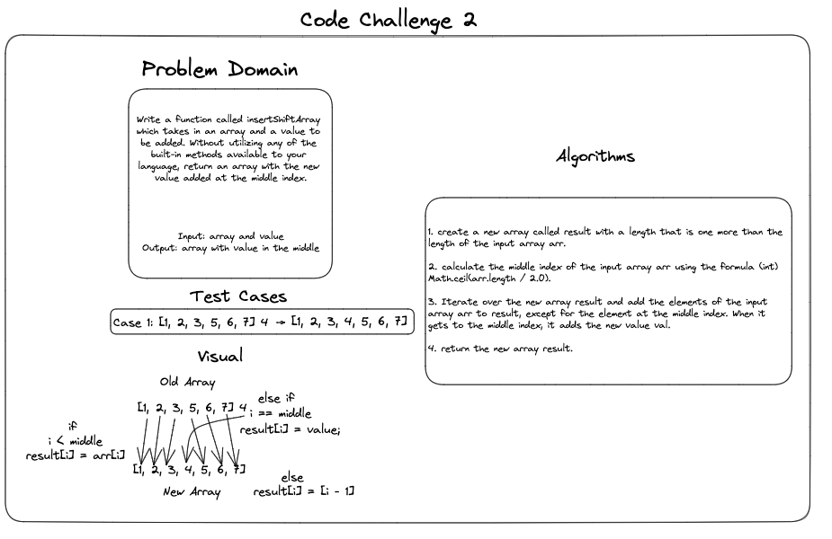

# Code Challenge 2

## Whiteboard



``` java

public static int[] insertShiftArray(int[] arr, int val) {
    int[] result = new int[arr.length + 1];
    int mid = (int) Math.ceil(arr.length / 2.0);

    for (int i = 0; i < result.length; i++) {
        if (i < mid) {
            result[i] = arr[i];
        } else if (i == mid) {
            result[i] = val;
        } else {
            result[i] = arr[i - 1];
        }
    }

    return result;
}
```
